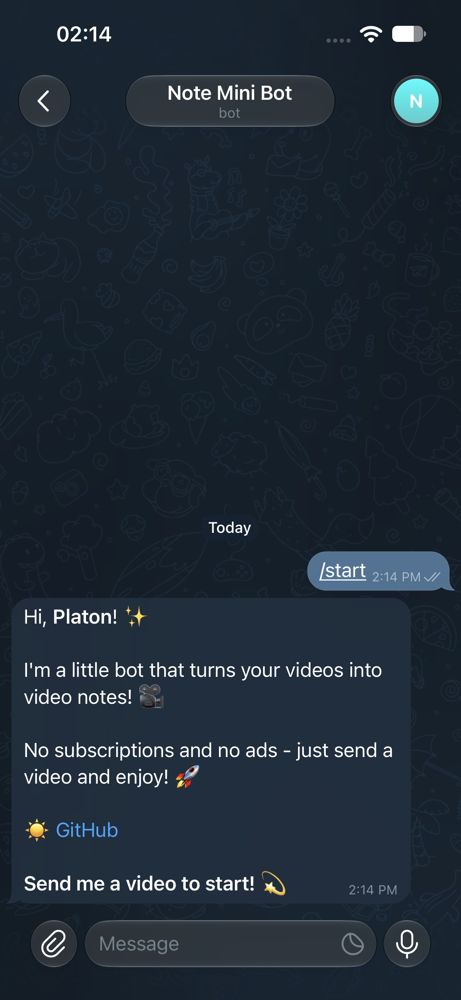
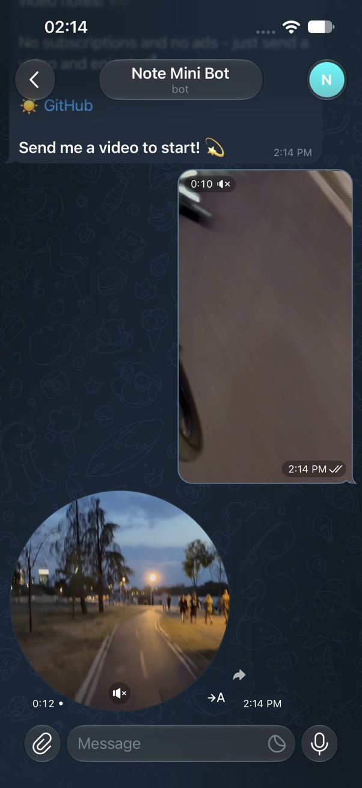

# VideoNoteBot

A small Telegram bot that turns any video into a round video note. Send a video, get a circle back. No ads, no subscriptions.

Built with [aiogram 3](https://docs.aiogram.dev/) and [FFmpeg](https://ffmpeg.org/).

## Features

- Send a video (or a video file) and get a round video note
- Videos longer than 60 seconds are rejected (Telegram limit)
- Temporary files are deleted after conversion

## Screenshots

<table>
  <tr>
    <td align="center"></td>
    <td align="center"></td>
  </tr>
  <tr>
    <td align="center"><b>/start</b></td>
    <td align="center"><b>Send a video → get a round note</b></td>
  </tr>
</table>

## Requirements

- Python 3.10+
- FFmpeg
- A bot token from [@BotFather](https://t.me/BotFather)

## Install FFmpeg

**macOS**

```bash
brew install ffmpeg
```

**Windows**

```powershell
winget install --id Gyan.FFmpeg
```

**Linux**

```bash
sudo apt install ffmpeg
```

Then check that it works:

```bash
ffmpeg -version
```

If `ffmpeg` is not on your PATH, set `FFMPEG_PATH` in `.env` (see below).

## Setup

```bash
git clone https://github.com/platilich/Note-Mini-Bot.git
cd Note-Mini-Bot
```

**macOS / Linux**

```bash
python3 -m venv venv
source venv/bin/activate
pip install -r requirements.txt
```

**Windows**

```powershell
python -m venv venv
.\venv\Scripts\Activate.ps1
pip install -r requirements.txt
```

Create a `.env` file in the project root:

```
TOKEN=your-telegram-bot-token
```

Optional, if FFmpeg is not on PATH:

```
FFMPEG_PATH=C:\ffmpeg\bin\ffmpeg.exe
```

Run the bot:

```bash
python bot/main.py
```

Open the bot in Telegram, send `/start`, then send a video.

## License

MIT. See [LICENSE](LICENSE).
