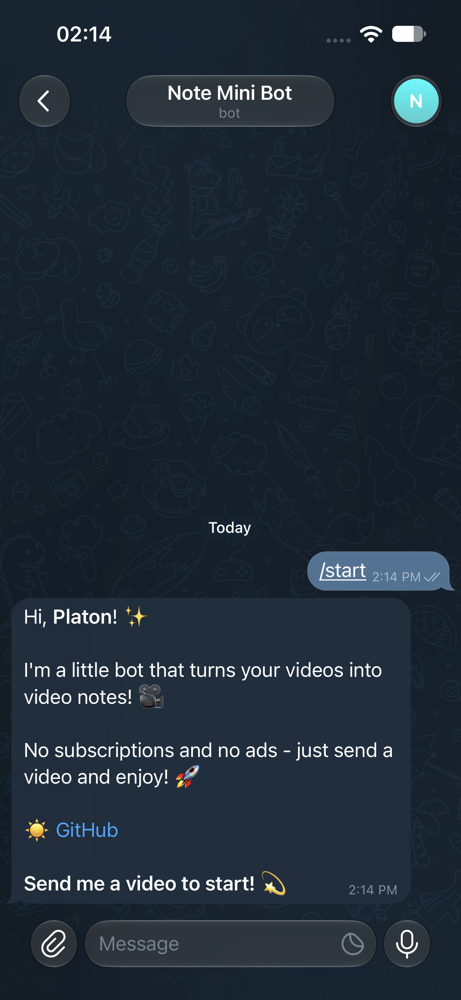
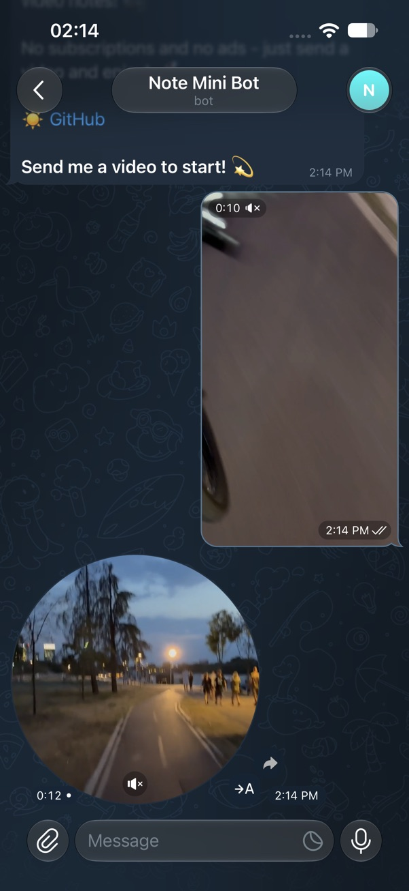
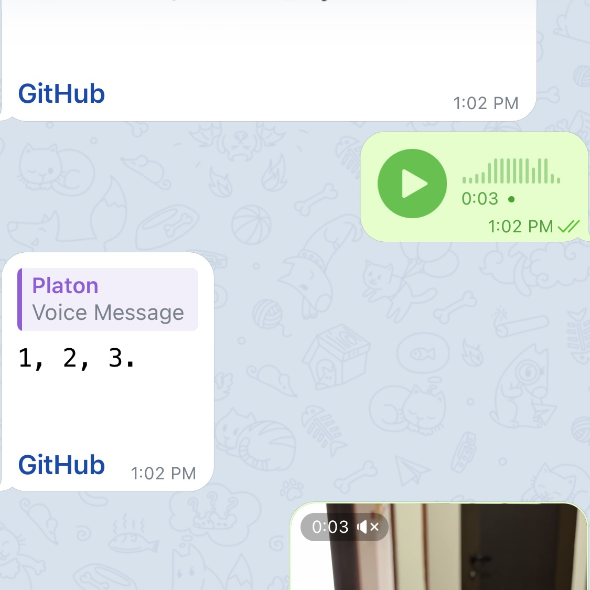
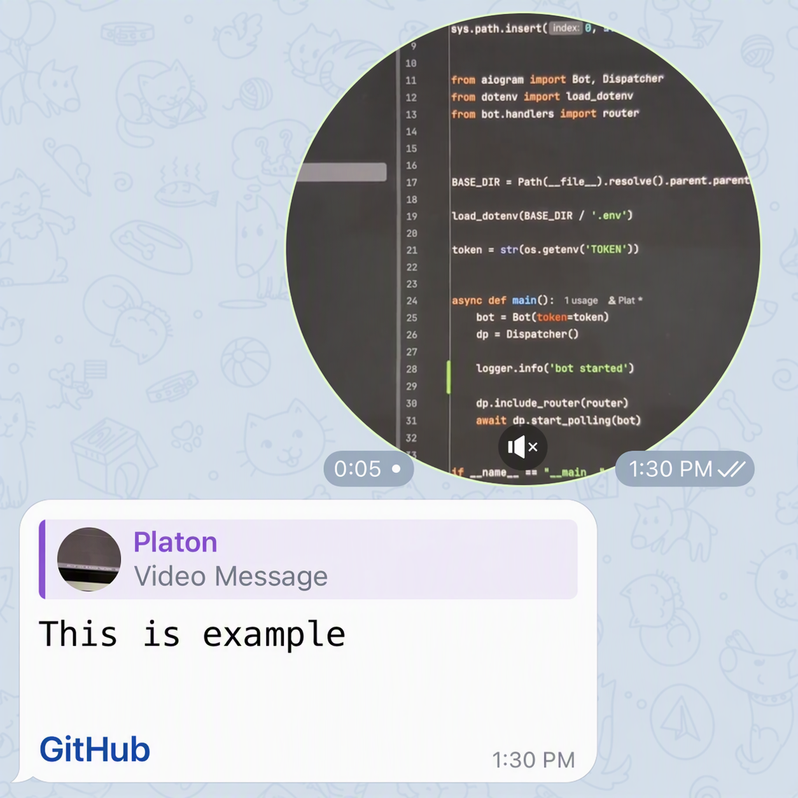

# NoteCircle

Launching a bot on a VPS with systemd settings


## Features
- Send a video and get a round video note
- Send a voice message or video note and get text

## Screenshots
<table>
  <tr>
    <td></td>
    <td align="center"></td>
  </tr>
  <tr>
    <td align="center"><b>/start</b></td>
    <td align="center"><b>Send a Video → Get a video note</b></td>
  </tr>
  <tr>
    <td align="center"></td>
    <td align="center"></td>
  </tr>
  <tr>
    <td align="center"><b>Voice message Transcription</b></td>
    <td align="center"><b>Video Note Transcription</b></td>
  </tr>
</table>

## Dependencies

- A Linux server (Ubuntu 20.04+, Debian 11+, etc.)
- SSH access to the server
- Python3
- FFmpeg

## Frameworks

- Aiogram
- Sqlite3
- Django


## Step 1: Connect to your server

```bash
ssh username@your_server_ip
```

Replace `username` and `your_server_ip` with your actual values.

## Step 2: Install requirements

```bash
sudo apt update && sudo apt upgrade -y
sudo apt install -y python3 python3-venv python3-pip ffmpeg git
```

## Step 3: Clone the bot

```bash
cd /home/your_username
git clone https://github.com/platilich/NoteCircle.git
cd NoteCircle
```

Replace `your_username` with your actual server username.

## Step 4: Create virtual environment

```bash
python3 -m venv venv
source venv/bin/activate
pip install -r requirements.txt
```

## Step 5: Create .env file

```bash
nano .env
```

Paste this:

```
TOKEN=your_telegram_bot_token_here
API_KEY=your_api_key_from_groq
```

Get your bot token from [@BotFather](https://t.me/BotFather) on Telegram.
Get your api key from [@BotFather](https://console.groq.com/keys).


Save: press `Ctrl + X`, then `Y`, then `Enter`.


## Step 6: Create DB

```
python manage.py migrate
```

## Step 7: Systemd

The bot will start automatically when the server starts.

### Create service file

```bash
sudo nano /etc/systemd/system/NoteCircle.service
```

### Paste this text

Replace these:
- `your_username` — your server username
- `/home/your_username/NoteCircle` — full path to the bot directory you can see your directory with command ```pwd```

```ini
[Unit]
Description=NoteCircle
After=network.target

[Service]
Type=simple
User=your_username
WorkingDirectory=/home/your_username/NoteCircle
EnvironmentFile=/home/your_username/NoteCircle/.env
ExecStart=/home/your_username/NoteCircle/venv/bin/python bot/main.py
Restart=always
RestartSec=5

[Install]
WantedBy=multi-user.target
```

Save: press `Ctrl + X`, then `Y`, then `Enter`.

### Enable auto start

```bash
sudo systemctl daemon-reload
sudo systemctl enable NoteCircle
sudo systemctl start NoteCircle
```

Done. The bot now runs in the background and restarts automatically.

___

## Useful commands

### Check status

```bash
sudo systemctl status NoteCircle
```

You should see: `active (running)`.

### See live logs

```bash
sudo journalctl -u NoteCircle -f
```

Stop viewing: press `Ctrl + C`.


### Stop the bot

```bash
sudo systemctl stop NoteCircle
```

### Start the bot

```bash
sudo systemctl start NoteCircle
```

___


### I would appreciate it if you starred this repository.
